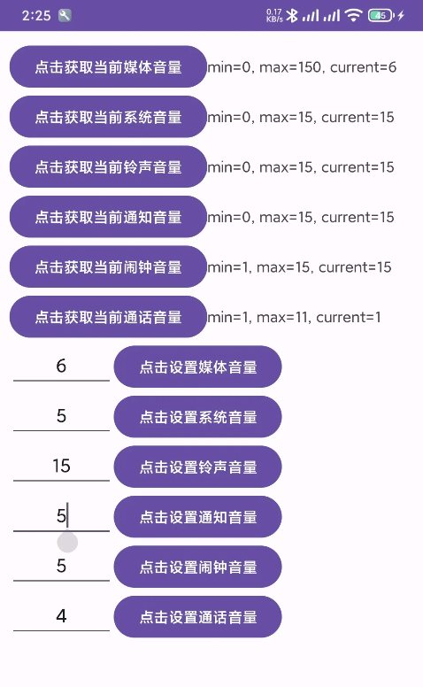

# 一、介绍

| **六大原生类型** | **小米系统中的体现【其余未测试】** |
| ---------------- | ---------------------------------- |
| 媒体音量         | 媒体音量                           |
| 系统音量         | 铃声音量 或者 铃声和通知音量       |
| 铃声音量         |                                    |
| 通知音量         |                                    |
| 闹钟音量         | 闹钟音量                           |
| 通话音量         | 通话音量                           |

# 二、通过 Java 控制音量

```java
public class VolumeUtil {

    private static AudioManager mAudioManager;

    public static void Init(Context context) {
        mAudioManager = (AudioManager) context.getSystemService(Service.AUDIO_SERVICE);
    }

    // region 获取最小音量

    // 最大媒体音量
    public static int getMinMediaVolume() {
        if (Build.VERSION.SDK_INT >= Build.VERSION_CODES.P) {
            return mAudioManager.getStreamMinVolume(AudioManager.STREAM_MUSIC);
        }
        return 0;
    }

    // 最大系统音量
    public static int getMinSystemVolume() {
        if (Build.VERSION.SDK_INT >= Build.VERSION_CODES.P) {
            return mAudioManager.getStreamMinVolume(AudioManager.STREAM_SYSTEM);
        }
        return 0;
    }

    // 最大铃声音量
    public static int getMinRingVolume() {
        if (Build.VERSION.SDK_INT >= Build.VERSION_CODES.P) {
            return mAudioManager.getStreamMinVolume(AudioManager.STREAM_RING);
        }
        return 0;
    }

    // 最大通知音量
    public static int getMinNotificationVolume() {
        if (Build.VERSION.SDK_INT >= Build.VERSION_CODES.P) {
            return mAudioManager.getStreamMinVolume(AudioManager.STREAM_NOTIFICATION);
        }
        return 0;
    }

    // 最大闹钟音量
    public static int getMinAlarmVolume() {
        if (Build.VERSION.SDK_INT >= Build.VERSION_CODES.P) {
            return mAudioManager.getStreamMinVolume(AudioManager.STREAM_ALARM);
        }
        return 0;
    }

    // 最大通话音量
    public static int getMinCallVolume() {
        if (Build.VERSION.SDK_INT >= Build.VERSION_CODES.P) {
            return mAudioManager.getStreamMinVolume(AudioManager.STREAM_VOICE_CALL);
        }
        return 0;
    }

    // endregion

    
    // region 获取最大音量

    // 最大媒体音量
    public static int getMaxMediaVolume() {
        return mAudioManager.getStreamMaxVolume(AudioManager.STREAM_MUSIC);
    }

    // 最大系统音量
    public static int getMaxSystemVolume() {
        return mAudioManager.getStreamMaxVolume(AudioManager.STREAM_SYSTEM);
    }

    // 最大铃声音量
    public static int getMaxRingVolume() {
        return mAudioManager.getStreamMaxVolume(AudioManager.STREAM_RING);
    }

    // 最大通知音量
    public static int getMaxNotificationVolume() {
        return mAudioManager.getStreamMaxVolume(AudioManager.STREAM_NOTIFICATION);
    }

    // 最大闹钟音量
    public static int getMaxAlarmVolume() {
        return mAudioManager.getStreamMaxVolume(AudioManager.STREAM_ALARM);
    }

    // 最大通话音量
    public static int getMaxCallVolume() {
        return mAudioManager.getStreamMaxVolume(AudioManager.STREAM_VOICE_CALL);
    }

    // endregion

    
    // region 获取当前音量

    // 当前媒体音量
    public static int getCurrentMediaVolume() {
        return mAudioManager.getStreamVolume(AudioManager.STREAM_MUSIC);
    }

    // 当前系统音量
    public static int getCurrentSystemVolume() {

        return mAudioManager.getStreamVolume(AudioManager.STREAM_SYSTEM);
    }

    // 当前铃声音量
    public static int getCurrentRingVolume() {
        return mAudioManager.getStreamVolume(AudioManager.STREAM_RING);
    }

    // 当前通知音量
    public static int getCurrentNotificationVolume() {
        return mAudioManager.getStreamVolume(AudioManager.STREAM_NOTIFICATION);
    }

    // 当前闹钟音量
    public static int getCurrentAlarmVolume() {
        return mAudioManager.getStreamVolume(AudioManager.STREAM_ALARM);
    }

    // 当前通话音量
    public static int getCurrentCallVolume() {
        return mAudioManager.getStreamVolume(AudioManager.STREAM_VOICE_CALL);
    }

    // endregion

    
    // region 设置音量

    // 设置媒体音量
    public static void setMediaVolume(int volume) {
        mAudioManager.setStreamVolume(AudioManager.STREAM_MUSIC, volume, AudioManager.FLAG_PLAY_SOUND | AudioManager.FLAG_SHOW_UI);
    }

    // 设置系统音量
    public static void setSystemVolume(int volume) {
        mAudioManager.setStreamVolume(AudioManager.STREAM_SYSTEM, volume, AudioManager.FLAG_PLAY_SOUND | AudioManager.FLAG_SHOW_UI);
    }

    // 设置铃声音量
    public static void setRingVolume(int volume) {
        mAudioManager.setStreamVolume(AudioManager.STREAM_RING, volume, AudioManager.FLAG_PLAY_SOUND | AudioManager.FLAG_SHOW_UI);
    }

    // 设置通知音量
    public static void setNotificationVolume(int volume) {
        mAudioManager.setStreamVolume(AudioManager.STREAM_NOTIFICATION, volume, AudioManager.FLAG_PLAY_SOUND | AudioManager.FLAG_SHOW_UI);
    }

    // 设置闹钟音量
    public static void setAlarmVolume(int volume) {
        mAudioManager.setStreamVolume(AudioManager.STREAM_ALARM, volume, AudioManager.FLAG_PLAY_SOUND | AudioManager.FLAG_SHOW_UI);
    }

    // 设置通话音量
    public static void setCallVolume(int volume) {
        mAudioManager.setStreamVolume(AudioManager.STREAM_VOICE_CALL, volume, AudioManager.FLAG_PLAY_SOUND | AudioManager.FLAG_SHOW_UI);
    }

    // endregion

}
// 初始化工具类
VolumeUtil.Init(getApplicationContext());

// 获取媒体音量的最大值
int min = VolumeUtil.getMinMediaVolume();

// 获取媒体音量的最小值
int max = VolumeUtil.getMaxMediaVolume();

// 获取当前媒体音量的值
int current = VolumeUtil.getCurrentMediaVolume();
```

# 三、安卓 Demo 下载

界面预览

